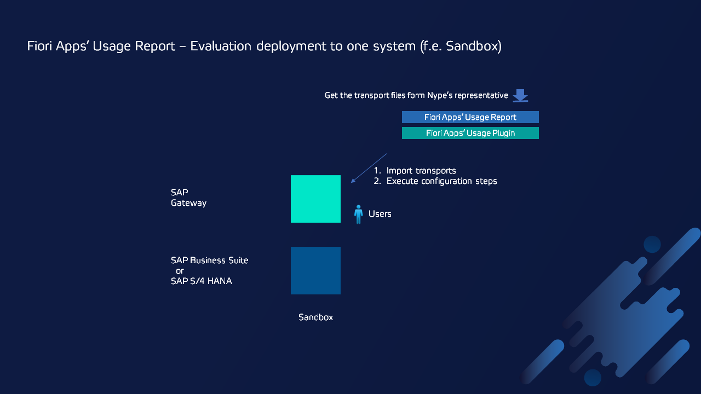

# Fiori App Usage Report - Evaluation deployment

The simplest deployment option to evaluate Fiori App Usage is the installation of all required products in one system (f.e. in Sandbox system).

The products that you need to install are:

1. Fiori App Usage Report
2. Fiori App Usage Plugin

## Other deployment options

1. [Fiori App Usage Report on production](https://fioritracker.org/fiori-app-usage/deployment/)
