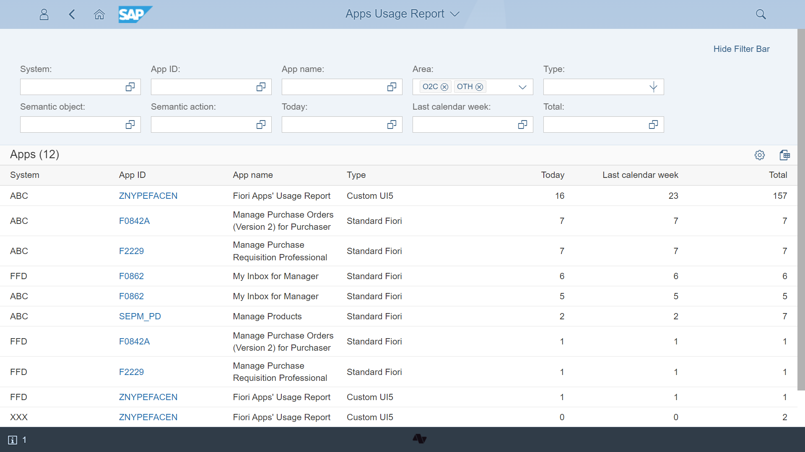

# Learn more about Fiori App Usage Report

The report enables monitoring of SAP Fiori application usage in your SAP landscape.

Each time the user starts the application in SAP Fiori launchpad Fiori App Usage plugin collects start records with time stamps. Based on the collected records, the tool provides a report on the most frequently used apps:

You can filter out the records from a chosen system, specific functional area, or application type.

All usage records are available for download in an [Excel format](FPS01/features/posts/recexp.md). Downloaded data can be further analyzed or visualized in a separate application.

## [Features](FPS01/features/index.md)

## [Architecture](arch/architecture.md)

## [Configuration](FPS01/conf.md)

## [Installation](FPS01/inst.md)

## [FAQ](faq.md)

